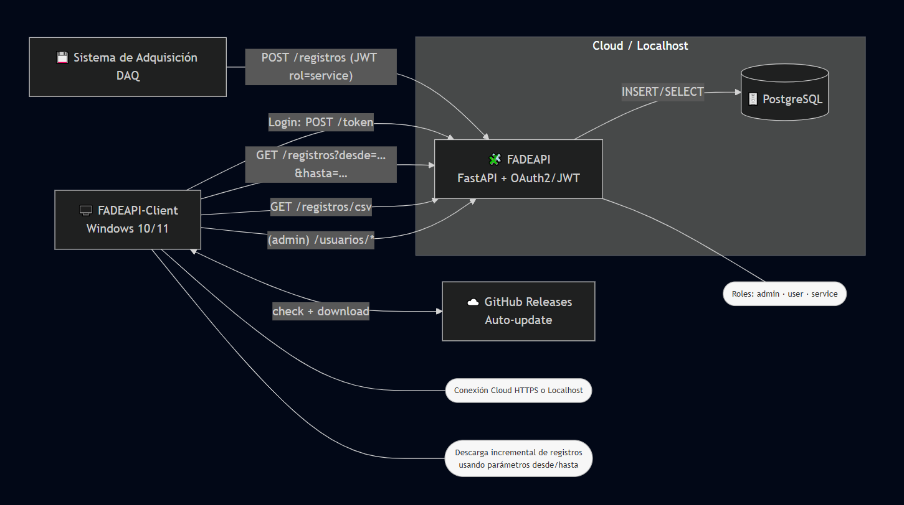

# FAdeAPI-Client

## 📌 Función

**FAdeAPI-Client** es una aplicación de escritorio diseñada para que personal técnico y no técnico pueda **visualizar, consultar y analizar** en tiempo real los datos provenientes del sistema de adquisición de datos de FAdeA.

El software se conecta directamente con **FAdeAPI**, que centraliza y expone la información capturada por el sistema de adquisición (DAQ) en los bancos de ensayos estructurales y otros equipos de medición.

Su objetivo es:

* **Facilitar el acceso a datos de ensayo** sin necesidad de conocimientos avanzados de programación.
* **Acelerar la toma de decisiones** al mostrar tablas y gráficos listos para análisis técnico.
* **Mantener sincronización automática** con los últimos registros almacenados en el servidor.

---
## 🔗 Integración con la API y el sistema de adquisición

El cliente se integra con **FAdeAPI** usando peticiones HTTPS (en modo “cloud”) o HTTP (modo “localhost” para entornos de laboratorio).
El flujo es el siguiente:

1. El sistema DAQ adquiere y guarda los registros (fecha/hora y valores de sensores).
2. **FAdeAPI** recibe y almacena estos datos en su base de datos.
3. **FAdeAPI-Client** consulta la API para obtener los datos más recientes y los presenta en:

   * **Tabla de registros** (filtro incremental para optimizar ancho de banda).
   * **Gráfico de señales** (representación lineal de cada sensor).
4. El usuario puede cambiar entre modo **cloud** o **local** según el entorno de trabajo.

**Diagrama de integración:**

## ✨ Características

* **Consulta incremental**: solo descarga nuevos datos desde el último registro disponible.
* **Visualización integrada**:

  * Tabla de registros con scroll y filtrado.
  * Gráfico lineal de señales en pestaña dedicada.
* **Modo de conexión seleccionable**: Cloud (producción) o Local (desarrollo/laboratorio).
* **Auto-actualización**:

  * Detección automática de nuevas versiones.
  * Descarga directa desde GitHub Releases.
  * Instalación guiada sin intervención manual avanzada.
* **Preferencias de usuario**:

  * Recuerda credenciales de inicio de sesión.
  * Tema claro/oscuro aplicable al instante.
* **Compatibilidad**:

  * Windows 10/11 (x64).

---
## 🛠 Instalación

1. Descargue el instalador más reciente desde la sección [Releases](https://github.com/marzzelo/FAdeAPI-client/releases/latest).
2. Ejecute el archivo `FADEAPI-Client_Setup_<versión>_win64.exe`.
3. Siga las instrucciones del instalador.
4. Inicie la aplicación desde el menú de inicio o el acceso directo en el escritorio.

> 💡 **Actualización**: Si hay una nueva versión disponible, la aplicación lo notificará y ofrecerá descargarla e instalarla automáticamente.

## 🚀 Uso básico

1. **Inicie sesión** con sus credenciales de FAdeAPI (opcional: marque “Recordar mis credenciales”).
2. Seleccione en **Configuración** el modo de conexión: Cloud o Local.
3. Use la pestaña **Registros** para ver los datos crudos en tabla.
4. Use la pestaña **Gráfico** para analizar las señales visualmente.
5. Presione **Actualizar** o **Actualizar (incremental)** para traer nuevos datos.

## 📄 Requisitos

* Conexión a internet (modo Cloud).
* Acceso a la API local (modo Local).
* Windows 10/11 (64 bits).
* Permisos para instalar software.

---
## 🧩 Estructura interna (para referencia técnica)

* **UI**: PySide6 (Qt).
* **Gráficos**: matplotlib integrado en la UI.
* **HTTP**: `requests` para comunicación con la API.
* **Auto-update**: integración con GitHub Releases.
* **Build**: PyInstaller.

---
## 🔒 Seguridad y autenticación

El sistema implementa prácticas y estándares actuales para proteger credenciales, tokens y datos en tránsito:

- **OAuth 2.0 (Password Grant)** para autenticación de usuario contra la API.  
  Referencia: *RFC 6749* (OAuth 2.0 Authorization Framework).

- **Tokens JWT** firmados **HS256** con expiración:
  - `access_token` de corta vida.
  - `refresh_token` de vida extendida y **renovación** (rotación al refrescar cuando corresponde).  
  Referencia: *RFC 7519* (JSON Web Token).

- **Transporte cifrado (TLS 1.2+)** en modo Cloud (HTTPS).  
  En entornos corporativos se usa el **almacén de certificados del sistema** mediante `truststore` para compatibilidad con inspección TLS.

- **Hash de contraseñas con bcrypt** (sal por usuario, costo configurable).  
  Buenas prácticas actuales para almacenamiento seguro de credenciales.

- **Control de acceso por roles (RBAC)**:
  - `admin`: administración de usuarios y operaciones críticas.
  - `user`: consumo de datos.
  - `service`: ingreso automatizado de registros desde el DAQ.

- **Superficie acotada de API** con **OpenAPI 3.1** publicada; facilita auditoría, pruebas y validación de contratos.

- **Buenas prácticas operativas**:
  - Tokens de acceso de corta duración y refresh de larga, minimizando exposición.
  - **HTTPS-only** en producción.
  - Separación de responsabilidades entre **ingesta (service)** y **consumo (user/admin)**.

## 📬 Soporte

Para reportar errores o solicitar nuevas funciones, utilice la sección [Issues](https://github.com/marzzelo/FAdeAPI-client/issues) del repositorio.

